# The Ray Tracer Challenge
This is my implementation of [Jamis Buck](https://github.com/jamis)'s amazing book [The Ray Tracer Challenge](https://pragprog.com/titles/jbtracer) using C#.

## Demo :rocket:
Enjoy the demo here: [TheRayTracerChallenge](https://nekketsu.github.io/TheRayTracerChallenge).

## Goals:
- [x] Implement the book as a C# console application.
- [x] Implement the book as a [Blazor WebAssembly](https://blazor.net) PWA application.
- [x] Share as much code as possible between the C# console application and the [Blazor WebAssembly](https://blazor.net) application.
- [x] Host the [Blazor WebAssembly](https://blazor.net) in [GitHub Pages](https://pages.github.com): [TheRayTracerChallenge](https://nekketsu.github.io/TheRayTracerChallenge).

## Structure
The source code is in the `src` folder, and the demo, [TheRayTracerChallenge](https://nekketsu.github.io/TheRayTracerChallenge), is in the `docs` folder as required by [GitHub Pages](https://pages.github.com).

## Solution
The solution, as described above, is in the `src` folder, and it contains the following important items:
- `RayTracer` project: It is the most important piece of code as it implements the data structures and algorithms described in the book. It is shared between the C# console applications and [Blazor WebAssembly](https://blazor.net) application.
- `RayTracer.Tests` project: It implements all the unit tests described in the book.
- `RayTracer.Demos` project: It implements, as a class library, all the demos of the solution. It makes use of the `RayTracer` project. It is shared between the C# console applications and [Blazor WebAssembly](https://blazor.net) application.
- `RayTracer.Demos.Tests` projects: It implements some unit tests that make sure that some needed constraints are followed.
- `Demos` folder: Contains several projects implementing the `RayTracer.Demos` demos as C# console applications. These demos make use of the `RayTracer` and `RayTracer.Demos` projects.
- `RayTracer.Demos.Browser`: It is a C# console application used as a container to execute all the demos. It makes use of `RayTracer` and `RayTracer.Demos` projects.
- `RayTracer.Blazor` Project: It is the [Blazor WebAssembly](https://blazor.net) implementation of the demos in `RayTracer.Demos` project. It makes use of `RayTracer` and `RayTracer.Demos` projects.
- `Mazes.Services` Project: It implements some services and helper methods used by other projects.
- `Mazes.Services.Test`: It is a C# console applications used as a container of all the demos. It allows us to select and execute any demo.

## Final thoughts
It has been an awesome experience to share code between the C# the console applications and the [Blazor WebAssembly](https://blazor.net) application, making it very straightforward to convert to a web application the implementation of the book with very little effort.

Please, feel free to send issues or pull requests. Any feedback is always welcome!

## Examples
<table>
  <tr>
    <td></td>
    <td></td>
    <td></td>
    <td></td>
  </tr>
  <tr>
    <td>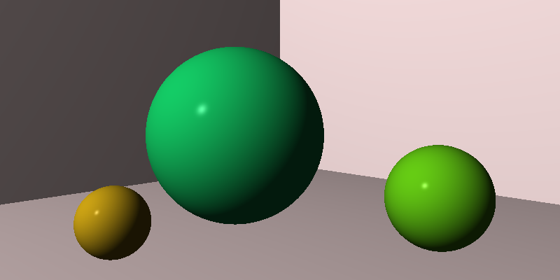</td>
    <td>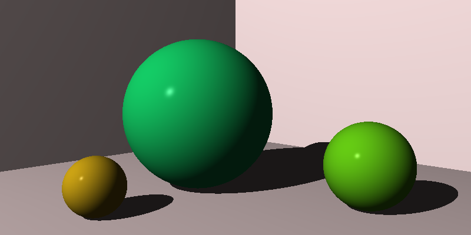</td>
    <td>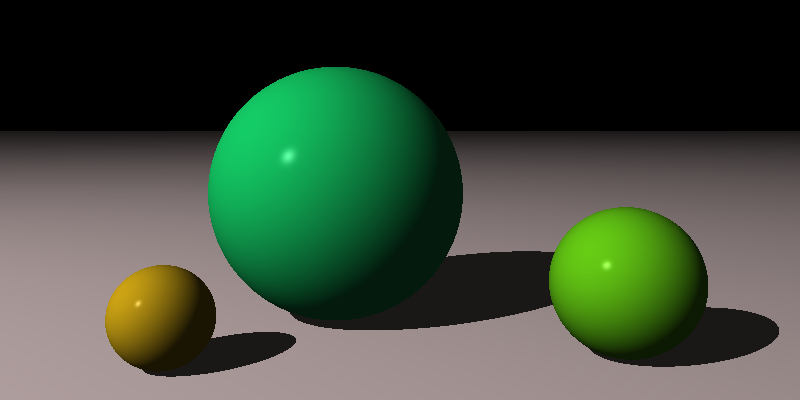</td>
    <td>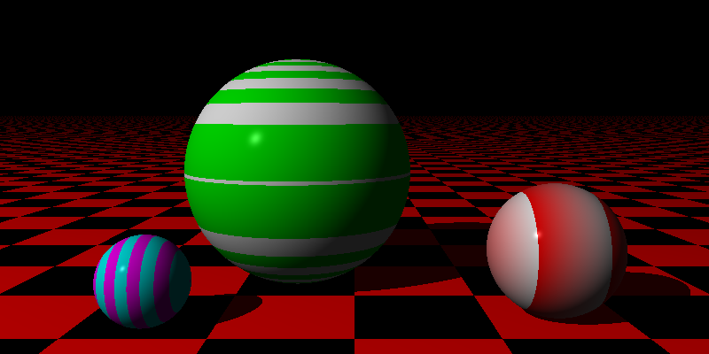</td>
  </tr>
  <tr>
    <td>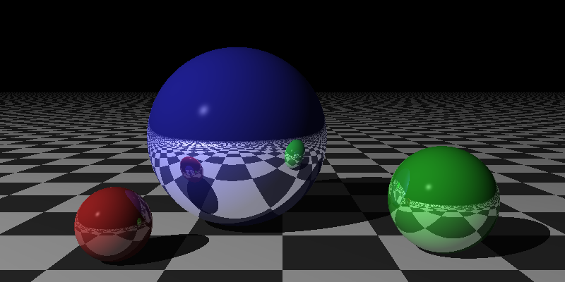</td>
    <td>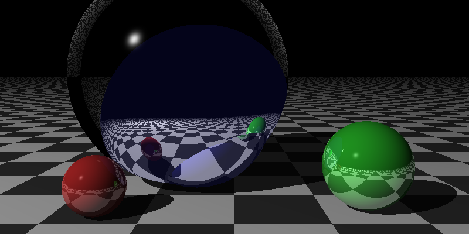</td>
    <td>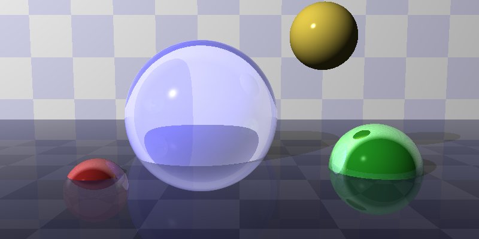</td>
    <td>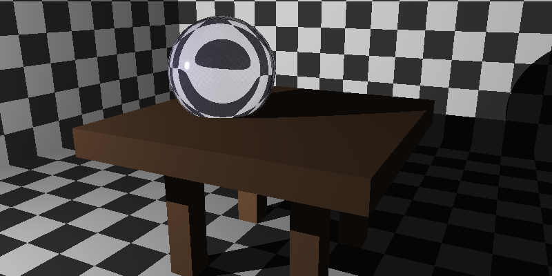</td>
  </tr>
  <tr>
    <td>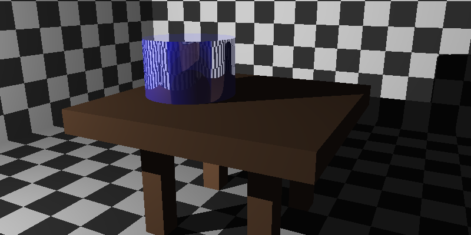</td>
    <td>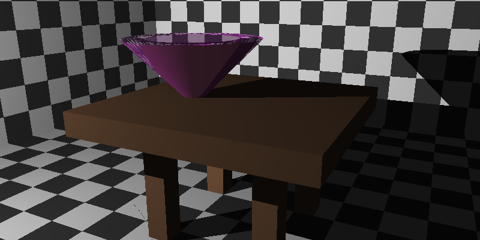</td>
    <td></td>
    <td></td>
  </tr>
  <tr>
    <td></td>
    <td></td>
    <td>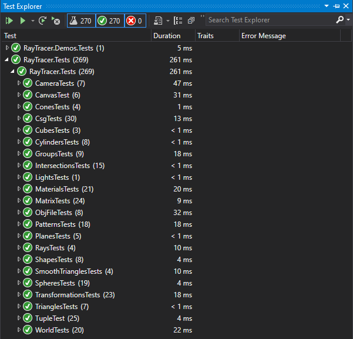</td>
    <td>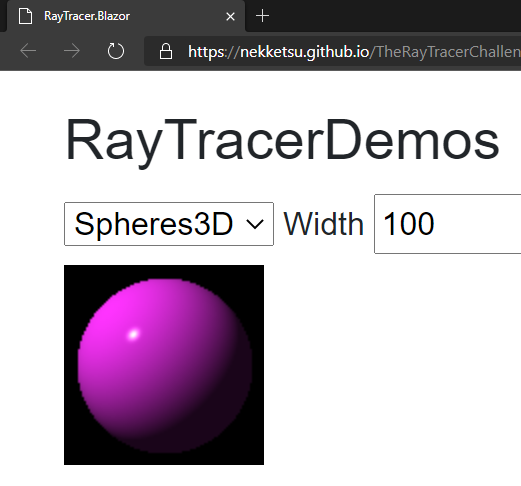</td>
  </tr>
</table>
